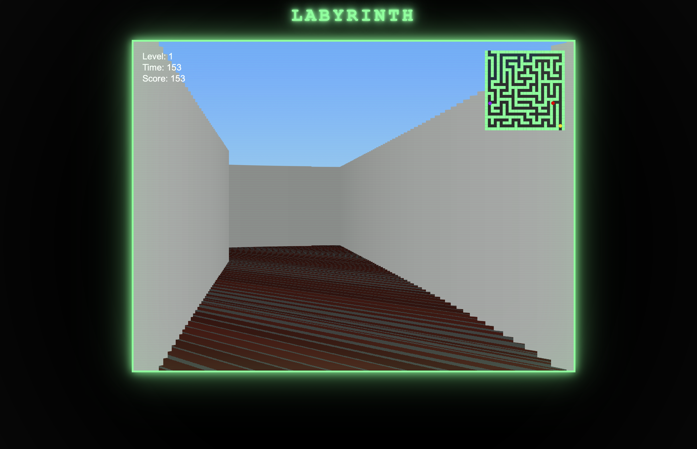

# 🧩 LABYRINTH 🧩
## 🎮 Live Simulation Preview

<p align="center">
  
</p>

*Real-time raycasting engine with adaptive AI difficulty and ML-driven telemetry modeling.*
## Adaptive Raycasting AI Simulation Engine

LABYRINTH is a browser-based 3D raycasting engine integrated with a full-stack machine learning backend that dynamically adapts survival difficulty based on real-time behavioral telemetry.

It combines low-level graphics programming with production-style ML architecture inside a modular simulation platform.


---

### Core Capabilities
- Custom 3D raycasting renderer (no external libraries)

- Procedural maze generation (iterative DFS / recursive backtracking)

- Axis-separated collision detection with radius prevention

- Real-time distance shading

- Device-pixel optimized floor rendering via ImageData

- Steering-based AI pursuit behavior

- Minimap overlay (player, monster, goal tracking)

- DPR-aware canvas scaling

- CRT-inspired retro rendering aesthetic

- Game state boot + restart system

- The engine is designed to demonstrate real-time rendering fundamentals, procedural systems, and deterministic game loop architecture.


##  🎮 Controls

### 🕹️ W / S – Move forward / backward

### 🕹️ A / D – Turn left / right

### 👾 ENTER – Start game

##  🖱️ Click – Restart after defeat

# 🚀 Live Demo
### 🧩 (https://labyrinth-ai-engine.onrender.com) 🧩

## 🎮 Features

- 3D raycasting engine (Wolfenstein-style rendering)
- Procedural maze generation using recursive backtracking
- Textured floor rendering with device-pixel optimization
- Real-time distance shading
- AI-driven pursuing monster with steering behavior
- Minimap overlay with player/goal/monster tracking
- Boot screen state management
- Restart system
- DPR-aware canvas scaling
- CRT retro visual aesthetic

## 🧠 Technical Highlights

- Custom raycasting implementation (no external libraries)
- Axis-separated collision with radius prevention
- Device-pixel optimized ImageData floor rendering
- Steering-based AI pursuit system
- Infrastructure-ready production structure

## 🛠 Tech Stack

- JavaScript (ES6+)
- HTML5 Canvas
- CSS3 (CRT visual effects)
- Procedural texture generation
- Git version control
This project demonstrates production-style ML architecture inside an interactive simulation system.

---

## 🏗 System Architecture
```
┌──────────────────────────┐
│        Browser UI        │
│  Raycasting + Telemetry  │
└─────────────┬────────────┘
              │
              ▼
┌──────────────────────────┐
│        FastAPI API       │
│  /telemetry  /train      │
└─────────────┬────────────┘
              │
   ┌──────────┼──────────┐
   ▼          ▼          ▼
┌──────────┐ ┌──────────┐ ┌────────────┐
│ ML Engine│ │ Story    │ │ Leaderboard│
│Inference │ │ Engine   │ │ Analytics  │
└──────────┘ └──────────┘ └────────────┘
        │
        ▼
┌────────────────────────┐
│ Adaptive Difficulty +  │
│ Narrative Modulation   │
└────────────────────────┘
```

### 🧠 System Overview
LABYRINTH is structured as a full-stack ML simulation platform.

Browser → Telemetry → FastAPI → ML Engine → Adaptive Output → Story Engine

### 🖥 Frontend
- Vanilla JavaScript raycasting renderer
- Player movement + collision system
- Monster AI pursuit logic
- Survival time
- Dynamic difficulty adjustments

### ⚙ Backend (FastAPI)
- REST API architecture
- Telemetry ingestion endpoint
- ML inference service
- Optional training trigger endpoint
- Analytics hooks
- Service-layer abstraction


### POST /train

Trigger model retraining (if enabled in configuration).

Example Response:
```josn
{
  "status": "training_started"
}
```

### 🔹 Online Inference

Located in:
```
app/services/ml_engine.py
```
---

## ⚙️ Local Development (macOS)

### ✅ Requirements
- macOS
- Python 3.9+
- Git
### Verify Python installation:
```
bash
python3 --version
```
### 1️⃣ Clone the Repository
```
bash
git clone https://github.com/Gift3dMyndZ/labyrinth-ai-engine.git
cd labyrinth-ai-engine
```
### 2️⃣ Create & Activate Virtual Environment
```
bash
python3 -m venv venv
source venv/bin/activate
```

### 3️⃣ Install Dependencies
```
bash
pip install --upgrade pip
pip install -r requirements.txt
```
### 4️⃣ Run the Application
```
bash
uvicorn app.api.main:app --reload
```

#### If uvicorn is not recognized:
```
bash
python3 -m uvicorn app.api.main:app --reload
```

### 5️⃣ Open in Browser

http://127.0.0.1:8000

### ✅ Notes
- macOS uses python3 by default.
- The --reload flag enables auto-restart during development.
- Ensure models/model.pkl exists before running inference.

---

## 🐳 Docker Deployment

Build container:
```
docker build -t labyrinth-ai-engine .
```
Run container:
```
docker run -p 8000:8000 labyrinth-ai-engine
```
---
## 🔬 Design Principles
```
- Separation of concerns  
- Modular architecture  
- Reproducible ML workflows  
- Clear training vs inference boundary  
- Production-oriented folder structure 
- Clean import safety via __init__.py   
```
---

## 🛣 Roadmap
```
- Behavioral clustering  
- Hybrid psychological + telemetry modeling  
- Persistent database integration  
- Real-time difficulty recalibration  
- CI/CD automation
- Model versioning and artifact tracking
- Cloud scaling configuration
```
---

# 👤 Author

## Developed by - Joshua Wolfe

If you found this interesting, consider starring the repository ⭐